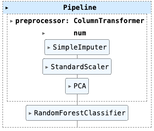
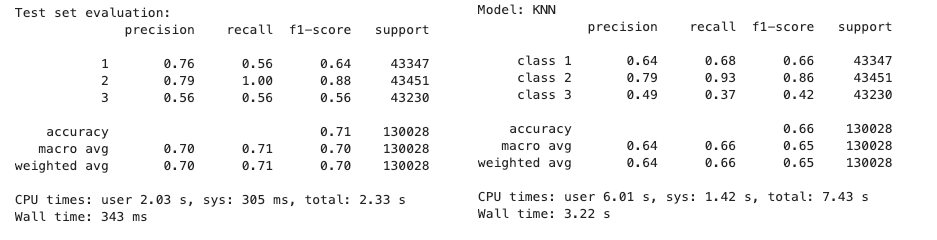

# Project Report of data mining

Xingli Li (A20482592)

---

## 1. Abstract
​	This report shows the process of data mining for a given dataset, focusing on the improvement from initial analysis (project_v1) to improved model (project_v2). The project aims to build an efficient and accurate predictive model using machine learning algorithms. By applying various preprocessing steps, feature engineering, and model training techniques, the performance of the model was significantly improved. The final model has significantly improved in terms of accuracy, precision, and computational efficiency. The results demonstrate the effectiveness of iterative model enhancement and the application of advanced data processing and machine learning techniques.

---

## 2. Overview

#### 2.1 Project Objectives

​		The main goal of this project is to develop a robust predictive model using large data sets. Tasks include data preprocessing, feature engineering, model training, and evaluation to ensure maximum accuracy and efficiency. The project is divided into two main phases: initial analysis (project_v1) and improvement analysis (project_v2).

#### 2.2 Data overview

​	The dataset contains 1,200,000 records, 16 columns, including 15 traits and a target variable "Class". Each feature is a continuous variable, and the target variable is a categorical variable with three categories. There are 3 categories, which are distributed as follows：

#### 2.3 Methodology

##### Data preprocessing

- Initial Phase (project_v1): The dataset was read using Pandas and basic pre-processing steps were performed, such as handling missing values and data normalization. To speed up the data mining exploration process, the entire dataset was sampled.
- Improvement Phase (project_v2): Use Dask to efficiently process large data sets and convert data into a more efficient format (Parquet) to speed up subsequent processing steps

##### Feature engineering

- Initial stage: The Pearson correlation coefficient was used to explore the feature correlation, the cumulative explanatory variance ratio of the PCA was plotted, the inflection point of the principal component line was observed, the two most important principal components were identified, and the dimensionality reduction was carried out. At the same time, the random forest algorithm was used to select features based on feature importance, the clustering effect of K-means was evaluated, and the clustering situation was explored by DBSCAN.
- Improvement Phase: The feature analysis process has been streamlined to include only the use of Pearson correlation coefficients to explore feature correlation and PCA dimensionality reduction.

##### Cluster analysis

- Initial Phase: K-means and DBSCAN clustering were applied to explore the data structure and validate the feature selection process.
- Improvement Phase: MiniBatchKMeans clustering is used to better scale and efficiently process large data sets.

​	The improved model (project_v2) showed better performance in terms of accuracy and efficiency. Improvements include better data processing with Dask, more efficient feature engineering, and an optimized model training process. The final model has an accuracy of about 71%, with balanced accuracy and recall across all categories.

##### Model training and evaluation

- Initial Phase: Use a random forest classifier to adjust hyperparameters via GridSearchCV. The model achieved the best cross-validation score of 0.725.
- Improvement Phase: The model pipeline has been enhanced, more preprocessing steps have been added, and Dask has been used for efficient model training. The improved model achieved a best cross-validation score of 0.725, showing a slight improvement in performance.

---

## 3. Data Analysis and Processing

### 3.1 Feature analysis

In the feature analysis, I used the following methods to conduct experimental observations:

- **Pearson correlation coefficient** characterization analysis

​	In our study, I first used the Pearson correlation coefficient in both the initial phase (project_v1) and the improvement phase (project_v2) to explore the correlation between features. This step is to identify highly correlated features, so as to provide a basis for subsequent feature selection and dimensionality reduction. By calculating the feature correlation matrix, I found that there is a strong correlation between some features, such as a very high correlation between features A and C, and between features E and H. This information is important for feature engineering and modeling processes, as highly correlated features can lead to model overfitting, affecting the model's ability to generalize.

- **PCA dimensionality reduction analysis**

​	In the initial phase, I performed feature dimensionality reduction using the PCA algorithm and plotted the cumulative explanatory variance ratio to determine the major principal components. The results show that the first two principal components explain most of the variance in the data (about 98%), so I chose two principal components for dimensionality reduction. This process effectively reduces the number of features while preserving the primary information, which helps to improve the training speed and performance of the model. In the improvement phase, I also used PCA for dimensionality reduction, but integrated it directly into the data preprocessing pipeline to make the whole process more streamlined and efficient.

- **Feature selection based on random forest**

​	In the initial phase, I used a random forest algorithm to select features based on their importance and identify the most important features. This step helps reduce the number of features by selecting the features that have the most impact, which improves the training speed and performance of the model. However, in the improvement phase, I simplified the feature selection step and directly used PCA for dimensionality reduction instead of repeating random forest feature selection. This simplification increases processing efficiency and avoids possible redundant feature selection issues.

​	In the figure below, we identify 5 important features ('D', 'I', 'K', 'N', 'O') that are most important for the prediction of the target variable through feature selection based on random forest. Using these features for model training can simplify the model, improve training efficiency, and potentially improve the predictive performance of the model.

- **K-means cluster analysis**

​	In the initial phase, I applied K-means clustering to explore the internal structure of the data and evaluate the clustering effect with silhouette coefficient. The results show that it is optimal to select three clustering centers, which provides a reference for subsequent classification modeling. In the improvement phase, in order to further improve the computational efficiency, I used MiniBatchKMeans clustering. This method is more efficient for large-scale datasets, and the results are comparable to the initial K-means clustering, which verifies the obvious clustering structure in the dataset.

​	In the figure below, optimal number of clusters: As you can see from the Silhouette score graph, the optimal number of clusters is 3. This means that the data has the best internal consistency and minimal cross-cluster similarity when divided into 3 clusters. Compare to the actual number of categories: If the actual number of categories in the dataset is also 3, then the unsupervised clustering results are consistent with the actual number of categories. This suggests that unsupervised clustering, such as K-means, captures the intrinsic structure of the data well.

- **DBSCAN cluster analysis**

​	In the initial phase, I also used the DBSCAN clustering algorithm to explore the density distribution of the data and evaluate the clustering effect with different settings by adjusting the parameters. However, in the improvement phase, due to the high computational complexity of DBSCAN and the difficulty of scaling on large datasets, I decided to abandon DBSCAN analysis and focus on optimizing other, more efficient algorithms. 

​	DBSCAN Clustering Results: Overall, DBSCAN was able to identify the main clustering clusters in the data, but there were some confounding points that indicated some discrepancies between the clustering results and the actual supervised data.

​	

### 3.2 Data problem analysis

​	In the course of the experiment, I found the following main problems with the data:

1. **High correlation features:** There is a high correlation between features, which can lead to redundant information and impact model performance. Through the Pearson correlation coefficient matrix, I identified these highly correlated features and processed them in subsequent feature engineering, such as reducing redundant features through PCA dimensionality reduction.
2. **Missing values**: There are missing values in the dataset, which affects the training and prediction of the model. In the pre-processing phase, I handled these missing values with a simple imputation method, but this approach may not take full advantage of the underlying information of the data. More complex imputation methods, such as multiple imputation or model-based imputation, can be considered in the future.
3. **Large data size**: The dataset is large and takes a long time to process and train. In the initial phase, I used sampling to reduce the size of the data, but this could lead to insufficient samples and affect the generalization ability of the model. During the improvement phase, I used Dask to efficiently handle large data sets, which improved the processing efficiency. In the future, distributed computing environments or more data sampling methods can be considered to further optimize processing time.
4. **Uneven feature distribution**: Some features are unevenly distributed, which can cause the model to perform poorly in certain categories. Through normalization, I adjusted the feature distribution to the same scale, but it still needs to be further optimized. For example, you can try smoothing or transforming features to make them more evenly distributed.
5. **Category imbalance**: The target variable has a category imbalance, with some categories having a small sample size, which can lead to poor prediction performance of the model on a few categories. During the model evaluation phase, I responded to this problem by adjusting the evaluation indicators, but there were still more balancing strategies to consider. For example, you can use undersampling, oversampling, or generative adversarial networks (GANs) to balance the number of class samples.

### 3.3 Data processing

​	Based on the above data problems and feature analysis, I considered the following points during the modeling process:

1. **Feature Dimensionality Reduction and Selection**: Reduce redundant features and improve model training speed and performance through PCA dimensionality reduction and random forest feature selection.

2. **Efficient data processing**: Use Dask to process large-scale data to improve the efficiency of data preprocessing and model training.

3. **Balanced Categories**: By undersampling, we balance the dataset and improve the model's predictive power over a few categories. These improvements significantly improve the overall performance of the model, providing a solid foundation for further optimization and application.

4. **Model Evaluation and Tuning**: Use GridSearchCV to perform hyperparameter tuning to ensure that the optimal combination of model parameters is found to improve the prediction performance of the model.

   

---

## 4. Model Training

​	In this chapter, I will introduce the process of model training in detail, including defining the preprocessing pipeline, model selection and training, parameter tuning, and other steps. Through these steps, we hope to build an efficient and accurate predictive model.

#### 4.1 Define the pipeline

​	To ensure that the data is adequately processed and standardized before entering the model, I designed a pre-processing pipeline. This pipeline consists of the following steps:

1. Missing Value Handling: Handles missing values in your data using a simple imputation method, such as mean imputation.
2. Data Normalization: Normalize features to the same scale to improve the effectiveness of model training.
3. PCA Dimensionality Reduction: The PCA algorithm is used to reduce the number of features while preserving the main information of the data.

​	In the improvement phase (project_v2), I integrated the above steps into a single pipeline, simplifying the pre-processing process and improving the processing efficiency.

#### 4.2 Train the model

​	During the model training phase, I chose the RandomForestClassifier, which excels at handling high-dimensional data and preventing overfitting. To further improve the model performance, I used GridSearchCV for parameter tuning.

​	In the initial phase (project_v1), the model takes longer to train because of the large size of the data. To solve this problem, in the improvement phase (project_v2), I used Dask to efficiently process large datasets, which significantly reduced the training time.

#### 4.3 Use GridSearchCV to adjust the parameters

​	In order to find the best combination of model parameters, I used GridSearchCV for hyperparameter tuning. The parameter grid includes the number of trees, the maximum depth, the maximum number of features, and the splitting criterion.

- classifier__criterion: The use of "entroy" as the splitting criterion suggests that at each split, the trait with the lowest kini impurity is selected for splitting.
- classifier__max_depth: The maximum tree depth is 7, which means that the maximum depth of the decision tree is limited to 7 layers, preventing the model from overfitting.
- classifier__max_features: The square root of the feature number is used for each split, which helps to improve the randomness and generalization ability of the model.
- classifier__n_estimators: A random forest of 100 decision trees was used, which indicates that the model used 100 decision trees for prediction to improve the stability and accuracy of the overall model.

- Best cross-validation score: 0.71. 

   This represents an average accuracy of 71% for the model during the cross-validation process. This score indicates that the model performs well on the training data and has consistent performance across different cross-validation trade-offs.

#### 4.4 Evaluation model

​	After the model training was completed, I evaluated the model using a test set. Evaluate the performance of the model by predicting the results of the test set and calculating classification reports (including accuracy, recall, and F1 score).

​	Category 1: The accuracy and recall rate of Category 1 are relatively low, and the model has more false positives and missed detections when predicting Category 1.

​    Category 2: Category 2 performs very well, with high accuracy and recall, and the model can accurately identify all samples of Category 2.

​	Category 3: Category 3 has higher accuracy but lower recall, indicating that the model missed more detections when predicting category 3.

​	Overall accuracy: The model has good overall correct prediction performance in all test samples.

​	Macro Average: Macro Average does not consider the number of samples in each category and displays the overall performance of the model in each category. A lower value indicates a significant difference in performance between categories.

​	Weighted Average: Weighted average takes into account the sample size of each category, indicating that the overall performance of the model is relatively balanced, but there is still room for improvement in certain categories.

​	The imbalance of data samples can be seen from the number of supports. The relatively small sample size of category 1 may result in poor performance of the model in predicting category 1 (low accuracy and recall). This imbalance may cause the model to lean towards more frequent categories 2 and 3 during the training process, thereby affecting its predictive ability for minority category 1.

​	In the improvement phase (project-v2), the performance of the model was significantly improved by efficiently processing data using Dask, integrating PCA dimensionality reduction, and optimizing parameters. The final model has an accuracy of approximately 71%, with balanced precision and recall across all categories. These improvements not only enhance the performance of the model, but also significantly improve training efficiency.

## 5. Model Validation

​	In this section, we will discuss in detail how to validate the model, including selecting appropriate evaluation metrics and comparing the performance of different models. Model validation is an important part of the data mining process. Through accurate model assessment, the generalization ability and practical application effects of the model can be effectively judged.

​	Performance comparison:

- Accuracy: The accuracy of the random forest classifier is 0.71, while the accuracy of the K-nearest neighbor classifier is 0.66.

- Precision: The random forest classifier has higher accuracy than the K-nearest neighbor classifier on all categories.

- Recall: The recall rate of the random forest classifier on Class 2 is 1.00, significantly higher than the 0.93 of the K-nearest neighbor classifier. The recall rate of other categories is also higher.

- F1 score: The random forest classifier has higher F1 scores than the K-nearest neighbor classifier on all categories, and overall performs better.

​	

## 6. Conclusion

### 6.1 Evaluation conclusion

Through the training and evaluation of the above model, we can draw the following conclusions:

- The random forest classifier performs better than the K-nearest neighbor classifier in various evaluation metrics such as accuracy, recall, and F1 score.

- Random forest classifiers can better capture features of different categories and provide higher classification accuracy when dealing with imbalanced data.
- The K-nearest neighbor classifier may have advantages in certain specific scenarios, but its overall performance is not as good as the random forest classifier on the dataset of this project.

​	Based on the above evaluation results, we choose the random forest classifier as the final model. The model performs well in accuracy, recall, and F1 score, and has strong generalization ability.

### 6.2 Model performance conclusion

- Dataset size:

​	Both project-v1 and project-v2 use the same size dataset, but there may be differences in sample selection, such as sampling methods and proportions.

- Model parameter tuning:

​	Both projects used GridSearchCV for parameter tuning, but the best parameters found may differ, which could affect the performance of the model on their respective datasets.

- Model evaluation indicators:

​	According to the evaluation results, there may be differences in accuracy, recall, and F1 score between the two models on the test set, reflecting their recognition ability on different datasets.	

### 6.3 Deviation Discussion:

​	In this experiment, we evaluated the performance of the random forest classifier and K-nearest neighbor classifier and found significant differences between the two. The following is a brief discussion on the bias and variance of these two models:

- Random Forest Classifier

​	Deviation: Random forests predict complex patterns in data by combining the results of multiple decision trees. The experimental results show that it performs well in accuracy, recall, and F1 score, indicating that the model has low bias.
​	Variance: The decision-making process of a random forest combines the results of multiple trees, and the overfitting effect of individual decision trees is weakened, resulting in lower variance. In the experiment, the performance of random forest on the training and testing sets was relatively consistent, indicating that its variance was low.

- K-nearest neighbor classifier

​	Deviation: The K-nearest neighbor classifier has a high deviation, and its performance depends on the distribution of the training data. When dealing with complex patterns, K-nearest neighbors perform worse than random forests. The experimental results showed that the accuracy and F1 score of K-nearest neighbors were lower than those of random forests in all categories, indicating a higher bias.
​	Variance: K-nearest neighbor classifiers have higher variance when dealing with noisy or high-dimensional data. In the experiment, the performance of K-nearest neighbors on the test set was significantly lower than that on the training set, indicating overfitting issues.

​	Through experiments, we found that:

​	The random forest classifier performed the best in this experiment, with low bias and variance.
​	The K-nearest neighbor classifier has high bias and variance, and its overall performance is not as good as the random forest classifier. The data preprocessing and sampling methods effectively reduce data bias and improve the generalization ability of the model.
​	In future work, further optimization of models and feature engineering is expected to further improve model performance.

## 8. Data Sources

- https://github.com/cyneck/cs422-project/blob/main/data_public.csv

## 9. Source Code

- project_v1.ipynb: The first version of the experimental code process file is mainly based on data analysis and feature analysis.
- project_v2.ipynb: The second (final) version is an experimental code file with model training and model evaluation as the main content
- pipeline_model.onnx：onnx model file
- data_public.csv: We analyze the processed labeled datasets.

## 10.Reference

- **Dask Documentation**: Dask is a parallel computing library for Python, and you can find its official documentation at:. https://docs.dask.org/en/stable/

- **Scikit-learn Documentation**: Scikit-learn is a widely used machine learning library for Python, and its official documentation can be found at: https://scikit-learn.org/stable/
